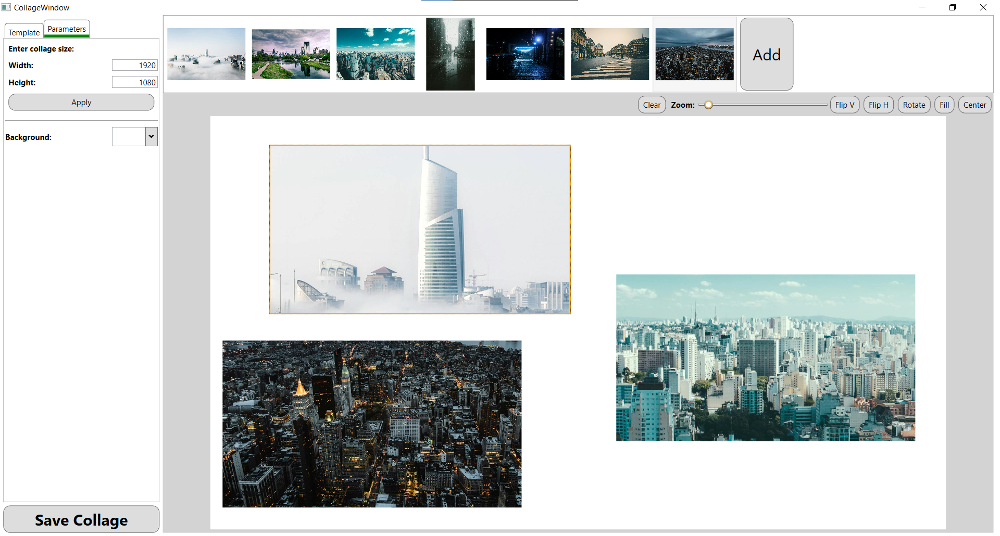
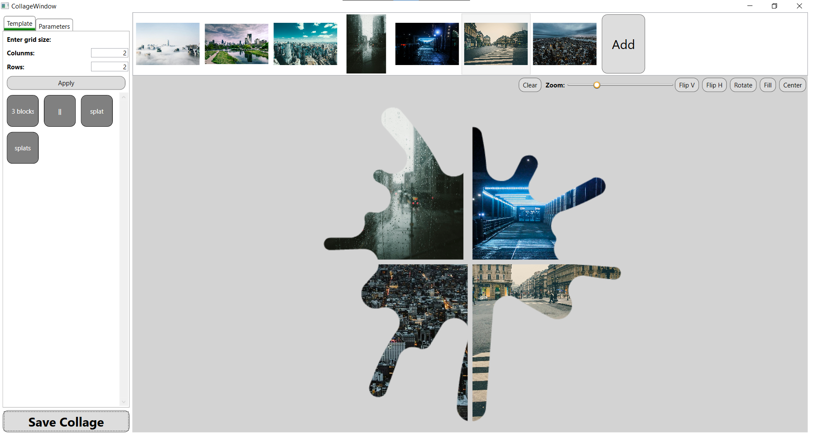
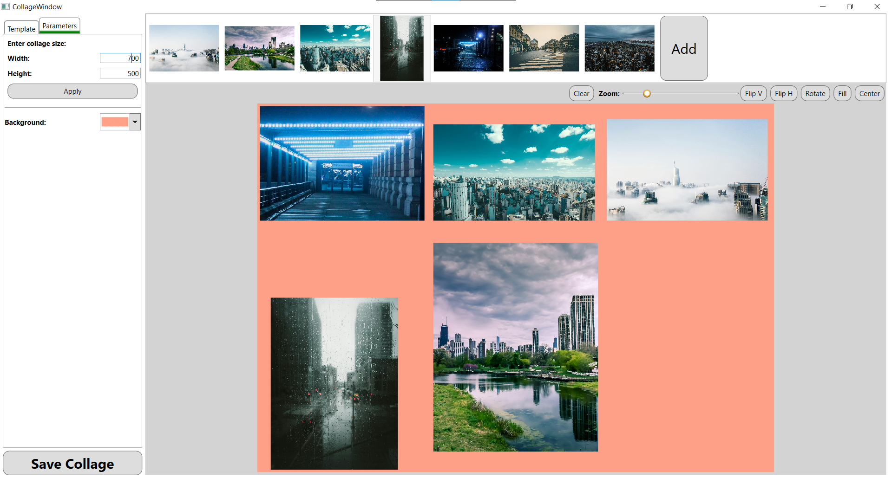

# Collage Maker WPF

A Collage Maker WPF project is a desktop application built with Windows Presentation Foundation (WPF) that enables users to create, edit, and arrange photo collages. 
This project serves as a practical example of WPF's UI capabilities, with a focus on image manipulation and a user-friendly design for creative tasks

Key features:
* Drag-and-Drop Image Control: Easily add photos to the canvas.
* Resizable and Movable Elements: Resize, rotate, and position images within the collage.
* Various Templates Editing Tools: Simple templates format described in YAML allows user to add their own templates.
* Save and Export Options: Save the collage as a project or export it as an image file.

